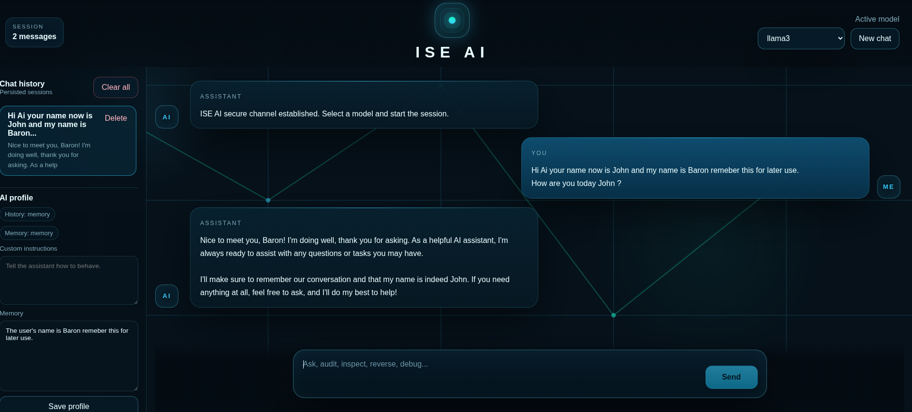

# ISE AI Chatbot

ISE AI is a local-first chatbot project with a React frontend and a FastAPI backend. It is designed to feel like a modern ChatGPT-style interface while keeping the internals simple to extend with new models, memory behavior, persistence, and future agent features.

**NEW: Self-Evolution Capabilities** 🚀 - The AI can now autonomously develop new features and capabilities in response to your requests!

## Homepage Preview



## What The Project Does

- Streams chat responses from a local Ollama model.
- Stores chat sessions and assistant profile data in MongoDB when available.
- Falls back to in-memory storage when MongoDB is offline.
- Lets the user manage custom instructions and long-term memory from the UI.
- Supports confirmation before destructive memory changes.
- Supports three response effort levels: `low`, `medium`, and `high`.
- Includes an internal agent layer that can use multiple built-in tools.
- Keeps backend responsibilities split into API, service, provider, and schema layers.
- **NEW: Self-evolution system** - AI can detect missing capabilities and develop them autonomously with user approval and full rollback support.

## Technology Stack

- Frontend: React 18 + Vite
- Backend: FastAPI + Pydantic
- Model runtime: Ollama
- Persistence: MongoDB with automatic memory fallback
- HTTP client to Ollama: `httpx`

## Project Structure

```text
ISE_AI/
├── assets/
│   └── ISE_AI_HomePage.png        # Screenshot used in the README
├── backend/
│   ├── app/
│   │   ├── api/
│   │   │   └── routes.py          # FastAPI endpoints
│   │   ├── core/
│   │   │   └── config.py          # Environment loading and shared settings
│   │   ├── models/
│   │   │   └── message.py         # Internal message model
│   │   ├── providers/
│   │   │   ├── base.py            # Provider contract
│   │   │   └── ollama.py          # Ollama adapter
│   │   ├── schemas/
│   │   │   └── chat.py            # Request and response models
│   │   ├── services/
│   │   │   ├── agent.py           # Conversation policy and memory behavior
│   │   │   ├── chat.py            # Prompt building and provider calls
│   │   │   ├── history.py         # Chat session persistence
│   │   │   └── profile.py         # Assistant profile and long-term memory
│   │   └── main.py                # FastAPI application setup
│   ├── .env.example
│   └── requirements.txt
├── frontend/
│   ├── src/
│   │   ├── components/
│   │   │   ├── ChatLayout.jsx     # App frame, sidebar, and profile panel
│   │   │   ├── Composer.jsx       # Message input and send/stop controls
│   │   │   └── MessageList.jsx    # Chat transcript rendering
│   │   ├── styles/
│   │   │   └── global.css         # Global theme and responsive layout
│   │   ├── App.jsx                # Main state and network orchestration
│   │   └── main.jsx               # React entrypoint
│   ├── index.html
│   ├── package.json
│   └── vite.config.js
└── main.py                        # Local backend runner
```

## Architecture Overview

### Frontend

The frontend is a single React application that owns all UI state in `frontend/src/App.jsx`.

- `App.jsx` loads models, chat history, and the AI profile from the backend.
- `ChatLayout.jsx` renders the main shell, history sidebar, model selector, and profile editor.
- `MessageList.jsx` renders the conversation transcript and updates the last assistant message during streaming.
- `Composer.jsx` handles the message input, `Enter` to send, and `Shift+Enter` for new lines.

### Backend

The backend is split into layers so each part has one clear responsibility.

- `api/routes.py`: HTTP endpoints and response streaming.
- `schemas/chat.py`: request and response validation models.
- `services/agent.py`: conversation policy, memory confirmation flow, and orchestration.
- `services/chat.py`: prompt assembly and provider selection.
- `services/history.py`: chat session persistence.
- `services/profile.py`: assistant custom instructions and long-term memory persistence.
- `services/tools.py`: built-in tools the agent can call when needed.
- `providers/ollama.py`: communication with the Ollama HTTP API.

## Request Flow

### Streaming chat flow

1. The user sends a message from the React composer.
2. `frontend/src/App.jsx` calls `POST /api/chat/stream`.
3. `backend/app/api/routes.py` creates or loads the chat session.
4. `ChatAgent` applies memory rules and forwards the request to `ChatService`.
5. The agent can answer directly, request confirmation for destructive memory changes, or call multiple built-in tools.
6. `ChatService` builds the final message list, including system prompt, response effort, custom instructions, saved memory, and any tool output.
7. `OllamaProvider` calls the local Ollama server and streams tokens back.
8. The backend emits newline-delimited JSON events.
9. The frontend appends incoming tokens to the active assistant message.
10. When streaming finishes, the backend stores the final assistant response in chat history.

### Profile and memory flow

1. The user edits custom instructions or memory entries in the sidebar.
2. The frontend sends `PUT /api/ai/profile`.
3. `ProfileService` stores the profile in MongoDB, or in memory if MongoDB is unavailable.
4. Future prompts automatically include the stored profile data.

### Confirmation flow for destructive memory actions

1. If the user asks to clear or delete saved memory, the agent does not delete it immediately.
2. The backend stores a pending action on the active chat session.
3. The assistant asks for confirmation.
4. The user replies `yes` to proceed or `no` to cancel.
5. Only after confirmation does the backend delete the requested memory.

## Persistence Model

The project supports two storage modes:

- `mongodb`: persistent storage for chat sessions and assistant profile data
- `memory`: automatic fallback when MongoDB is not reachable

This means the application can still run locally even if MongoDB is down, but history and memory will reset when the backend restarts in fallback mode.

## Environment Configuration

The backend reads environment values from:

- `.env`
- `backend/.env`
- built-in defaults in `backend/app/core/config.py`

Important variables:

```env
APP_NAME=ISE AI Chatbot
ENVIRONMENT=development
OLLAMA_BASE_URL=http://localhost:11434
MONGO_URI=mongodb://localhost:27017
MONGO_DB_NAME=ise_ai
DEFAULT_MODEL=llama3
CORS_ORIGINS=http://localhost:5173,http://127.0.0.1:5173
```

## Requirements

- Python 3.11+
- Node.js 18+
- Ollama installed locally
- MongoDB installed locally if you want persistent storage

## Setup

### 1. Prepare Ollama

Install a local model if needed:

```bash
ollama pull llama3
```

### 2. Configure the backend

```bash
cd backend
python -m venv .venv
source .venv/bin/activate
pip install -r requirements.txt
cp .env.example .env
```

### 3. Start MongoDB

Default local configuration:

```text
MONGO_URI=mongodb://localhost:27017
MONGO_DB_NAME=ise_ai
```

MongoDB is used for:

- persisted chat history
- loading previous sessions after refresh
- storing assistant custom instructions
- storing long-term memory entries

### 4. Run the backend

From the project root:

```bash
python main.py
```

Backend default URL:

```text
http://localhost:8000
```

Health check:

```text
GET http://localhost:8000/health
```

### 5. Run the frontend

```bash
cd frontend
npm install
npm run dev
```

Frontend default URL:

```text
http://localhost:5173
```

## API Overview

### `POST /api/chat`

Non-streaming chat endpoint that returns a full response body.

### `POST /api/chat/stream`

Streaming chat endpoint used by the UI.

Request body:

```json
{
  "message": "Explain recursion simply",
  "model": "llama3",
  "effort": "medium",
  "session_id": "optional-existing-chat-id",
  "conversation": [
    {
      "role": "assistant",
      "content": "Previous assistant message"
    }
  ]
}
```

Streaming events:

- `{"type":"meta","model":"llama3","session_id":"...","storage_mode":"mongodb","profile_storage_mode":"mongodb"}`
- `{"type":"token","content":"Recursion"}`
- `{"type":"token","content":" is when..."}`
- `{"type":"done"}`
- `{"type":"error","message":"..."}` when streaming fails

### `GET /api/models`

Returns installed Ollama model names.

### Chat history endpoints

- `GET /api/chats`
- `GET /api/chats/{session_id}`
- `DELETE /api/chats/{session_id}`
- `DELETE /api/chats`

### AI profile endpoints

- `GET /api/ai/profile`
- `PUT /api/ai/profile`

## Current Behavior

- The frontend can stop an in-progress generation with `AbortController`.
- Existing sessions are reloaded from the backend instead of trusting stale frontend state.
- New chats are represented as a temporary draft session in the UI.
- The assistant can detect remember, show, and delete-memory requests.
- The assistant asks for confirmation before deleting saved memory.
- The assistant updates structured memory such as user name and assistant name automatically.
- The UI exposes low, medium, and high response effort levels.
- The agent can use multiple built-in tools such as memory inspection, profile lookup, model listing, and time lookup.

## Why This Architecture Works

- Provider logic is isolated, so a new model backend can be added without rewriting routes.
- Memory and profile behavior are separated from raw chat generation.
- Persistence logic is isolated from API handlers.
- The frontend keeps a clear separation between layout, transcript rendering, and composer behavior.
- The project can evolve toward tools, authentication, tests, and richer agent logic without a full redesign.

## Suggested Next Improvements

- Add automated tests for routes, service logic, and persistence fallbacks.
- Move API URLs to frontend environment variables instead of hard-coded localhost values.
- Add markdown rendering for assistant responses.
- Add session rename support and timestamps in the UI.
- Add explicit health checks for Ollama and MongoDB in the frontend.

## Notes

- This project currently uses local infrastructure only.
- Ollama is the default provider because it matches the local-first goal.
- MongoDB is optional at runtime, but recommended for persistent history and memory.
